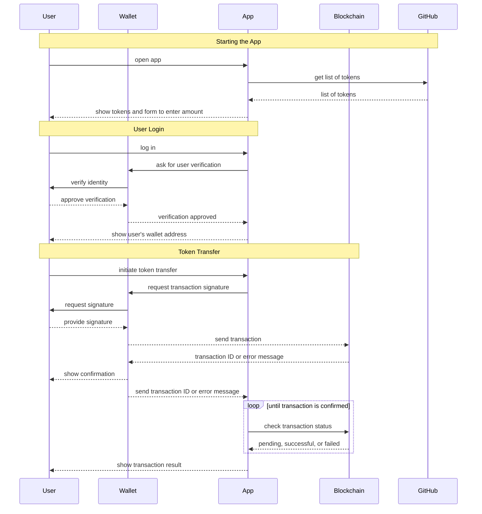

# Buy me a Coffee with dApp-Kit

The outcome of this tutorial is a React application capable of identifying a user's wallet, sending tokens, and verifying the transaction on the Vechain network.

You can open the resulting project on GitHub to check on all steps in parallel while reading each section.

Here is the sequence we are building during this Tutorial:



# Preparation

This tutorial is based on a pre-existing React project that has already been configured with widely-used libraries. It will focus on incorporating Vechain-specific modules into this project. Therefore, only information related to Vechain will be covered in this article. It assumes a basic understanding of React, such as managing states and passing props, which will not be explained.

- **@vechain/dapp-kit-react** - A collection of React hooks and components designed to facilitate the integration of the dApp kit into React applications.
- **@vechain/dapp-kit-ui** - A set of UI components aimed at simplifying the process of wallet selection and connection.
- **@vechain/sdk-core** - A library focused on providing features specific to Vechain.
- **@vechain/sdk-network** - A library created to streamline communication with Vechain nodes.

Install all these modules with npm:

```shell
npm install --save @vechain/dapp-kit-react @vechain/dapp-kit-ui @vechain/sdk-core @vechain/sdk-network
```

## Integrating the dApp-Kit

> You can read more about the dApp-Kit in their [docs section](https://docs.vechain.org/developer-resources/sdks-and-providers/dapp-kit/dapp-kit-1).

To connect your application to Vechain you will wrap it into a provider that will share a single connection and user authentification globally.

In our example app, this is done within the [`App.tsx`](https://github.com/ifavo/example-buy-me-a-coffee/blob/main/src/App.tsx).

Import the Provider:

```tsx
import { DAppKitProvider } from "@vechain/dapp-kit-react";
```

And wrap your content with it:

```tsx
    <DAppKitProvider
        // the network & node to connect to
        nodeUrl="https://testnet.vechain.org
        genesis="test"

        // remember last connected address on page reload
        usePersistence={true}
    >
        {children}
    </DAppKitProvider>
```

Consequently, you will have the capability to utilize functions such as `useWallet()` for user identification or `useConnex()` for interacting with Vechain.

## Integrating `useQuery`

By using [`@tanstack/react-query`](https://tanstack.com/query/latest), we will access vechain nodes directly to retrieve some data from the public infrastructure. Just like with dApp-Kit, you need a provider that enables shared fetch and cache management.

Import the Provider and establish a default client configuration:

```tsx
import { QueryClient, QueryClientProvider } from "@tanstack/react-query";
const queryClient = new QueryClient();
```

And wrap your dApp-Kit Provider with it:

```tsx
<QueryClientProvider client={queryClient}>
  <DAppKitProvider>..</DAppKitProvider>
</QueryClientProvider>
```

## Authentification

The entire authentication procedure is contained within a React component offered by the dApp-Kit.

The [`WalletButton`](https://docs.vechain.org/developer-resources/sdks-and-providers/dapp-kit/dapp-kit-1/react/usage#walletbutton) generates a button that prompts for connection or displays the address of the signed-in user.

By using this feature, our streamlined Menu will present either a connect button or the user's address within this one component.

```tsx
import { WalletButton } from "@vechain/dapp-kit-react";

export default function LayoutMenu() {
  return <WalletButton />;
}
```

By utilizing the [`useWallet()`](https://docs.vechain.org/developer-resources/sdks-and-providers/dapp-kit/dapp-kit-1/react/usage#usewallet) hook, we can already make use of the dApp-Kit's functionality to display a hint for signing in within our primary component.

```tsx
import { useWallet } from "@vechain/dapp-kit-react";
export default function BuyCoffee() {
  // get the connected wallet
  const { account } = useWallet();

  // if there is no wallet connected, ask the user to connect first
  if (!account) {
    return "Please connect your wallet to continue.";
  }

  return "Placeholder";
}
```

## Select Token from Registry

Vechain curates a public repository of tokens on [GitHub](https://github.com/vechain/token-registry) to streamline token interaction within decentralized applications (dApps).

> Have you published a new Token on Vechain? You are welcome to create a pull request to add it to the public registry!

We will utilize it to dynamically retrieve all recognized tokens within the application and enable the user to purchase a coffee using a token of their choosing.

To obtain the list, we will employ the `useQuery()` function:

```tsx
// fetch the token registry, to display a list of tokens
const tokenRegistry = useQuery({
  queryKey: ["tokenRegistry"],
  queryFn: async () =>
    fetch(`https://vechain.github.io/token-registry/main.json`).then((res) =>
      res.json()
    ),
});
```

The code snippet retrieves the list and returns its content. `useQuery()` offers useful functionalities such as a loading indicator, error handling, and automated retry attempts.

A loading indicator will be displayed during the loading process:

```tsx
if (tokenRegistry.isLoading) {
  return <IconLoading />;
}
```

In order to show the data, it can be presented in a dropdown menu:

```tsx
<>
  <label htmlFor="token" className="sr-only">
    Token
  </label>
  <select name="token" id="token">
    <option value="">VET</option>
    {tokenRegistry.data?.map((token) => (
      <option key={token.address} value={token.address}>
        {token.symbol}
      </option>
    ))}
  </select>
</>
```

We will display `VET` as a blank choice for utilizing Vechain's native token as a payment option if no token has been chosen. The complete component, along with its state management, can be found in the [`src/BuyCoffee/SelectToken.tsx` file on GitHub](https://github.com/ifavo/example-buy-me-a-coffee/blob/main/src/BuyCoffee/SelectToken.tsx).

## Prepare Token Sending

The [`@vechain/sdk-core`](https://www.npmjs.com/package/@vechain/sdk-core) library offers tools to easily create blockchain commands.

A "clause" is a single command, similar to a function call, that's included in a transaction. The `clauseBuilder` helps create these commands in a more straightforward way. Additionally, `unitsUtils` helps adjust user inputs to the correct format for the blockchain:

- `unitsUtils.parseVET(amount)` – Since VET tokens are divided into 18 decimal places, this function adjusts the input number to include these decimals, converting it into a format the blockchain can understand.
- `clauseBuilder.transferVET(recipient, parsedVET)` – This command creates instructions to send VET tokens to another wallet.
- `unitsUtils.parseUnits(amount, decimals)` – For tokens with a different number of decimal places, this function allows specifying the exact number of decimals to correctly format the amount.
- `clauseBuilder.transferToken(token, recipient, parsedAmount)` – This command generates instructions to send a specified amount of a particular token to another wallet.

> To explore more about the clauseBuilder and its additional functionalities, check out the [tsdocs](https://tsdocs.dev/docs/@vechain/sdk-core/1.0.0-beta.3/variables/core.clauseBuilder.html).

For our Buy me a Coffee with any token app this will translate into this snippet:

```tsx
const clauses = [
  // if a token was selected, transfer the token
  selectedToken
    ? // the clauseBuilder helps build the data for the transaction
      clauseBuilder.transferToken(
        selectedToken.address,
        RECIPIENT_ADDRESS,
        unitsUtils.parseUnits(amount, selectedToken.decimals)
      )
    : // or use the clauseBuilder to transfer VET by default
      clauseBuilder.transferVET(RECIPIENT_ADDRESS, unitsUtils.parseVET(amount)),
];
```
A valuable feature of Vechain Wallets is their ability to include comments, which explain individual clauses or entire transactions to the user.

By adding a `comment` attribute to the clause object, Wallets will display it alongside each clause for the user.

## Sending Tokens

Function calls on the Blockchain are executed by sending a transaction, which incurs a VTHO charge for each action based on the associated workload. To verify its identity, a transaction must be signed with the sender's private key.

After setting up the `DAppKitProvider`, we can use the `useConnex()` hook to connect to Vechain.

To have the user sign and send a transaction, we use `await connex.vendor.sign('tx', clauses).request()`.

Here's what happens during this process:

1. `sign('tx', clauses)` creates a transaction object with the specified clauses, using the blockchain settings from `DAppKitProvider`.
2. `request()` asks the user's wallet to get the user's signature for the transaction. This function is async, because it will wait until the wallet interaction is completed.
3. The wallet shows the transaction details to the user. If the user agrees and signs it, the transaction is forwarded to a Vechain node.
4. The Vechain node confirms the transaction by returning a transaction ID. This ID can be used to track the transaction's status.